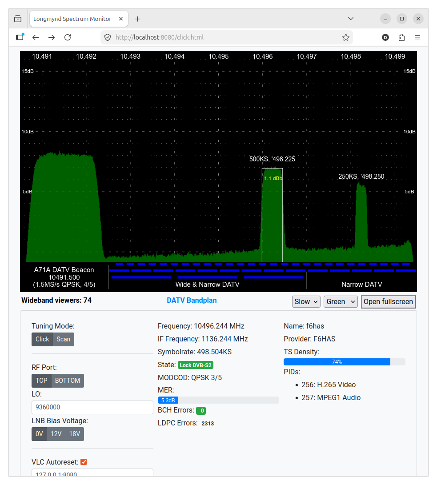
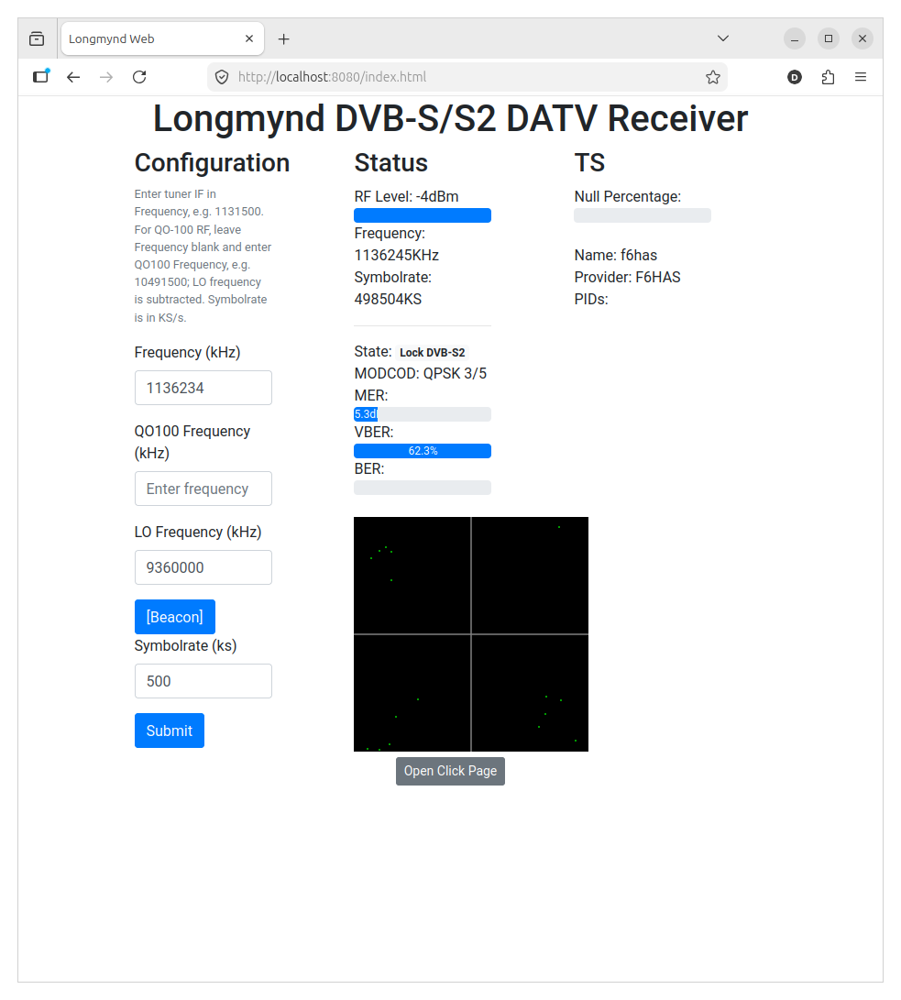
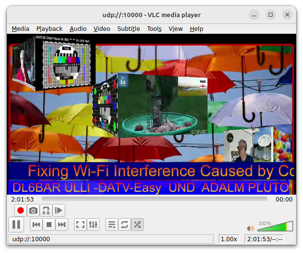

# Longmynd [](https://travis-ci.org/myorangedragon/longmynd)

An Open Source Linux ATV Receiver.

Copyright 2019 Heather Lomond

## Dependencies

    sudo apt-get install libusb-1.0-0-dev libasound2-dev libjson-c-dev libcap-dev cmake

To run longmynd without requiring root, unplug the minitiouner and then install the udev rules file with:

    sudo cp minitiouner.rules /etc/udev/rules.d/

## Compile

    make

## EARDA / Eardatek NIMs

Older EARDA/Eardatek MiniTiouner NIMs such as the `EDS-4B47FF1B+`
module use the STV0903 demodulator and STB6100 tuner path:

    ./longmynd -N earda -i 127.0.0.1 10000 -I 127.0.0.1 10001 1131500 1500

`-N eardatek` is also accepted as an alias.

## Running for QO-100 with LO 9360000 kHz

The frequency argument passed to longmynd is the tuner IF frequency in kHz,
not the satellite downlink frequency. Calculate it as:

    tuner_frequency_khz = satellite_frequency_khz - LO_frequency_khz

With your `9360000 kHz` LO, the QO-100 beacon at `10491500 kHz` becomes:

    10491500 - 9360000 = 1131500 kHz

### 9750 MHz vs 9360 MHz LNB PLL reference

A normal Ku-band PLL LNB usually derives its `9750 MHz` low-band local
oscillator from a `25 MHz` reference:

    25 MHz * 390 = 9750 MHz

That places the QO-100 beacon at:

    10491.500 MHz - 9750 MHz = 741.500 MHz

Some MiniTiouner NIMs can work with this lower IF. The EARDA/Eardatek
STV0903/STB6100 NIM used here needs a higher tuner input frequency to receive
QO-100 reliably, so this station runs the LNB PLL from `24 MHz` instead of
`25 MHz`. The same PLL divider then gives:

    24 MHz * 390 = 9360 MHz

and the QO-100 beacon moves to:

    10491.500 MHz - 9360 MHz = 1131.500 MHz

For these experiments, a dual-connector LNB was modified in a simple way to
allow injection of the external reference clock, with one connector used for
the normal IF/DC path and the other used for the external clock injection. The
clock source used was the PCS Electronics
[OCXO for QO-100, 3x user-defined frequencies, 330 kHz to 330 MHz](https://www.pcs-electronics.com/shop/rigexpert-products/other-reu-rigexpert-products/ocxo-for-qo-100-3x-user-defined-frequencies-330khz-330mhz/),
configured to provide the `24 MHz` LNB reference.

Run the EARDA/Eardatek MiniTiouner with UDP TS output, UDP status output, and
the web interface on port `8080`:

    ./longmynd -N earda -i 127.0.0.1 10000 -I 127.0.0.1 10001 -W 8080 -V longmynd -O 8082 1131500 1500

Open the web interface:

    http://localhost:8080/

    - or -

    http://localhost:8080/click.html



to use the clickable wideband spectrum.

### VLC HTTP Interface

The web interface can control VLC (stop/start playback when tuning) via VLC's
built-in HTTP interface. VLC must be started with a password and on a port that
does not conflict with LongMynd's own web server:

    vlc --http-password=longmynd --http-port=8082 udp://@:10000

Pass the same password and port to LongMynd with `-V` and `-O`:

    -V <password>   VLC HTTP interface password
    -O <port>       VLC HTTP interface port (default: 8082)

The web UI reads these values from LongMynd's status and includes the
credentials in its VLC control requests automatically. The `run.sh` script
demonstrates a working setup.

QO-100 DATV band sweep scripts and example reception reports are in
`QO-100-test/`. They use the same `9360000 kHz` LO by default and record
status/C/N/error data without writing video.

With the current EARDA/Eardatek status path, status ID `12` is a demodulator
C/N estimate in `dB * 10`. On the QO-100 beacon this setup now reports about
`8.2` to `8.9 dB` when locked cleanly, with `$23,0` for BCH uncorrected
status.

## Web Interface




This fork includes the browser interface ported from
[philcrump/longmynd](https://github.com/philcrump/longmynd/), another
LongMynd fork that added a web interface.

Builds use the `web/libwebsockets` git submodule. The normal `make` target
initializes and builds that submodule when needed.

Start longmynd with `-W <port>` and open the page in a browser. The example
command and URLs are shown in the EARDA/Eardatek run section above.

## Run

Please refer to the longmynd manual page via:

```
man -l longmynd.1
```

## Standalone

If running longmynd standalone (i.e. not integrated with the Portsdown software), you must create the status FIFO and (if you plan to use it) the TS FIFO:

```
mkfifo longmynd_main_status
mkfifo longmynd_main_ts
```

The test harness `fake_read` or a similar process must be running to consume the output of the status FIFO:

```
./fake_read &
```

A video player (e.g. VLC) must be running to consume the output of the TS FIFO. 



## Output

    The status fifo is filled with status information as and when it becomes available.
    The format of the status information is:
    
         $n,m<cr>
     
    Where:
         n = identifier integer of Status message
         m = integer value associated with this status message
      
    And the values of n and m are defined as:
    
    ID  Meaning             Value and Units
    ==============================================================================================
    1   State               0: initialising
                            1: searching
                            2: found headers
                            3: locked on a DVB-S signal
                            4: locked on a DVB-S2 signal 
    2   LNA Gain            On devices that have LNA Amplifiers this represents the two gain 
                            sent as N, where n = (lna_gain<<5) | lna_vgo
                            Though not actually linear, n can be usefully treated as a single
                            byte representing the gain of the amplifier
    3   Puncture Rate       During a search this is the pucture rate that is being trialled
                            When locked this is the pucture rate detected in the stream
                            Sent as a single value, n, where the pucture rate is n/(n+1)
    4   I Symbol Power      Measure of the current power being seen in the I symbols
    5   Q Symbol Power      Measure of the current power being seen in the Q symbols
    6   Carrier Frequency   During a search this is the carrier frequency being trialled
                            When locked this is the Carrier Frequency detected in the stream
                            Sent in KHz
    7   I Constellation     Single signed byte representing the voltage of a sampled I point
    8   Q Constellation     Single signed byte representing the voltage of a sampled Q point
    9   Symbol Rate         During a search this is the symbol rate being trialled
                            When locked this is the symbol rate detected in the stream
    10  Viterbi Error Rate  Viterbi correction rate as a percentage * 100
    11  BER                 Bit Error Rate as a Percentage * 100. For DVB-S2 this is
                            derived from the pre-BCH error counter.
    12  MER / C/N           Demodulator C/N estimate in dB * 10. This field is
                            historically named MER in LongMynd status output.
    13  Service             TS Service Name
    14  Service Provider    TS Service Provider Name
    15  Null Ratio          Ratio of Nulls in TS as percentage
    16  ES PID              Elementary Stream PID (repeated as pair with 17 for each ES)
    17  ES Type             Elementary Stream Type (repeated as pair with 16 for each ES)
    18  MODCOD              Received Modulation & Coding Rate. See MODCOD Lookup Table below
    19  Short Frames        1 if received signal is using Short Frames, 0 otherwise (DVB-S2 only)
    20  Pilot Symbols       1 if received signal is using Pilot Symbols, 0 otherwise (DVB-S2 only)
    21  LDPC Error Count    LDPC Corrected Errors in last frame (DVB-S2 only)
    22  BCH Error Count     BCH Corrected Errors in last frame (DVB-S2 only)
    23  BCH Uncorrected     1 if some BCH-detected errors were not able to be corrected, 0 otherwise (DVB-S2 only)
    24  LNB Voltage Enabled 1 if LNB Voltage Supply is enabled, 0 otherwise (LNB Voltage Supply requires add-on board)
    25  LNB H Polarisation  1 if LNB Voltage Supply is configured for Horizontal Polarisation (18V), 0 otherwise (LNB Voltage Supply requires add-on board)
    26  AGC1 Gain           Demodulator AGC1 gain value
    27  AGC2 Gain           Demodulator AGC2 gain value


### MODCOD Lookup

### DVB-S
```
0: QPSK 1/2
1: QPSK 2/3
2: QPSK 3/4
3: QPSK 5/6
4: QPSK 6/7
5: QPSK 7/8
```

#### DVB-S2
```
0: DummyPL
1: QPSK 1/4
2: QPSK 1/3
3: QPSK 2/5
4: QPSK 1/2
5: QPSK 3/5
6: QPSK 2/3
7: QPSK 3/4
8: QPSK 4/5
9: QPSK 5/6
10: QPSK 8/9
11: QPSK 9/10
12: 8PSK 3/5
13: 8PSK 2/3
14: 8PSK 3/4
15: 8PSK 5/6
16: 8PSK 8/9
17: 8PSK 9/10
18: 16APSK 2/3
19: 16APSK 3/4
20: 16APSK 4/5
21: 16APSK 5/6
22: 16APSK 8/9
23: 16APSK 9/10
24: 32APSK 3/4
25: 32APSK 4/5
26: 32APSK 5/6
27: 32APSK 8/9
28: 32APSK 9/10
```

## License

    Longmynd is free software: you can redistribute it and/or modify
    it under the terms of the GNU General Public License as published by
    the Free Software Foundation, either version 3 of the License, or
    (at your option) any later version.
    Longmynd is distributed in the hope that it will be useful,
    but WITHOUT ANY WARRANTY; without even the implied warranty of
    MERCHANTABILITY or FITNESS FOR A PARTICULAR PURPOSE.  See the
    GNU General Public License for more details.
    You should have received a copy of the GNU General Public License
    along with longmynd.  If not, see <https://www.gnu.org/licenses/>.
enses/>.
